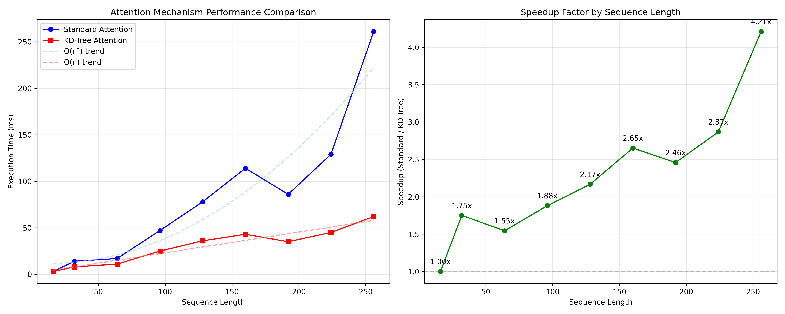

# StructuredAttention-Efficient-Transformer-Attention-via-Algorithmic-Optimization
Trying to accelerate transformer attention mechanisms through advanced data structures (KD-trees and segment trees), reducing the quadratic complexity of traditional attention to enable faster inference and longer sequence processing

## How Attention Mechanism Works Normally
Standard self-attention operates as follows:

1. Input preparation: You have three matrices derived from the input:

Queries (Q): What you're looking for
Keys (K): What you're comparing against
Values (V): What you're retrieving/aggregating

2. Similarity calculation: For each query and every key, compute their similarity:
S = Q × K^T
This matrix multiplication has O(n²) complexity.

3. Scaling: Scale the similarity scores to stabilize gradients:
S_scaled = S / sqrt(d_k)
where d_k is the dimension of the key vectors.

4. Softmax normalization: Apply softmax row-wise to get attention weights:
A = softmax(S_scaled)

5. Weighted aggregation: Combine values based on attention weights:
Output = A × V

This approach is computationally expensive primarily because steps 2 and 4 involve operations across all pairs of positions in the sequence.

## The innovations in this project are:

### KD-Tree for approximate similarity search:

- Instead of comparing each query with all keys (O(n²)), use a KD-tree to find the most similar keys in O(log n) time
- This approximates the full attention but dramatically reduces computation for long sequences
- Only compute attention weights for the most relevant keys (top-k selection)

### Sparse attention patterns implementation:

- Traditional attention computes dense attention weights
- This implementation tries to create sparse attention matrices
- Focus computational resources only on the most important connections

## Results

